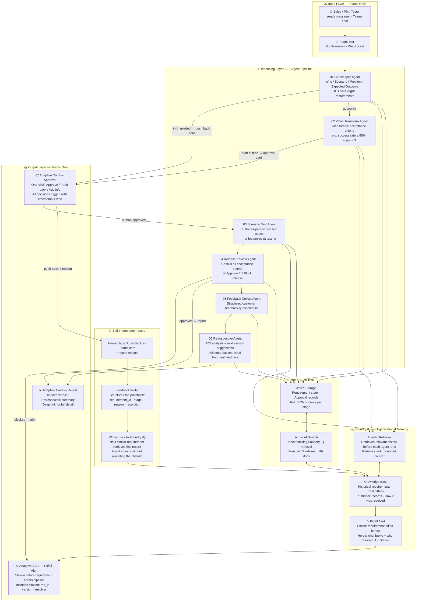

# Architecture: Requirement Chain Agent — Microsoft Version

> Track: Reasoning Agents (Microsoft Foundry + Foundry IQ)
> IM Layer: Microsoft Teams (Adaptive Cards)
> Core Principle: "IM as the only interface — AI handles everything in between"
> Self-Improvement: Human feedback loop → writes back to Foundry IQ → system gets smarter over time

---

## System Architecture Diagram



---

## The Self-Improvement Loop (Key Differentiator)

```
Normal flow:
  Requirement in → Agent reasons + Foundry IQ retrieves history → Card pushed to human

When human pushes back:
  Human taps "Push Back" + types reason in Teams card
          ↓
  Feedback Writer structures it:
  {
    "requirement_id": "req_001",
    "stage": "value_transform",
    "pushback_reason": "acceptance criteria too vague, missing metric",
    "resolution": "added: response time ≤ 2s, measured by p95 latency",
    "resolved_by": "PM Jackie",
    "timestamp": "2026-06-10T14:00:00+08:00"
  }
          ↓
  Written back into Foundry IQ knowledge base
          ↓
  Next time a similar requirement comes in:
  Agent retrieves: "Last time a similar req had vague criteria,
  PM pushed back asking for latency metric. Final version: ≤ 2s p95."
          ↓
  Agent pre-empts the problem. Fewer push backs over time.
```

**This is the "organizational memory" effect**: the system gets smarter with every human correction, without retraining any model.

---

## Layer Summary

| Layer | Responsibility | Technology |
|---|---|---|
| **Input** | Only entry point: Teams chat | Teams Bot Framework |
| **Reasoning** | 6-Agent multi-step pipeline | Azure OpenAI GPT-4o |
| **Foundry IQ** | Retrieve history with citations, surface pitfall alerts | Azure AI Foundry + AI Search |
| **Self-Improvement** | Human pushback → structured → written back to knowledge base | Feedback Writer module |
| **Output** | Only output: Adaptive Cards in Teams | Teams Adaptive Cards |
| **Storage** | State, audit trail, JSON schema per stage | Azure Storage + AI Search |

---

## Differentiation: Why This Isn't "Just Meeting Summary"

| Capability | Feishu AI / M365 Copilot | Requirement Chain Agent |
|---|---|---|
| Meeting / chat summary | ✅ | Not the focus |
| Record decisions | ✅ | ✅ |
| **Track if decisions actually resolved** | ❌ | ✅ |
| **Detect info loss across handoffs** | ❌ | ✅ Gatekeeper + JSON schema contracts |
| **"We tried this before, here's what broke"** | ❌ | ✅ Foundry IQ pitfall retrieval + citation |
| **Block release if criteria unmet** | ❌ | ✅ Release Review Agent |
| **Gets smarter from human corrections** | ❌ | ✅ Human feedback → Foundry IQ write-back |

---

## Microsoft IQ Compliance

✅ **Foundry IQ** integrated as organizational memory backbone
- Every agent queries Foundry IQ before reasoning
- Every pitfall alert includes citation (req_id, version, resolver)
- Human feedback writes back to Foundry IQ, closing the learning loop

Satisfies hard requirement: **at least one Microsoft IQ layer integrated**.
